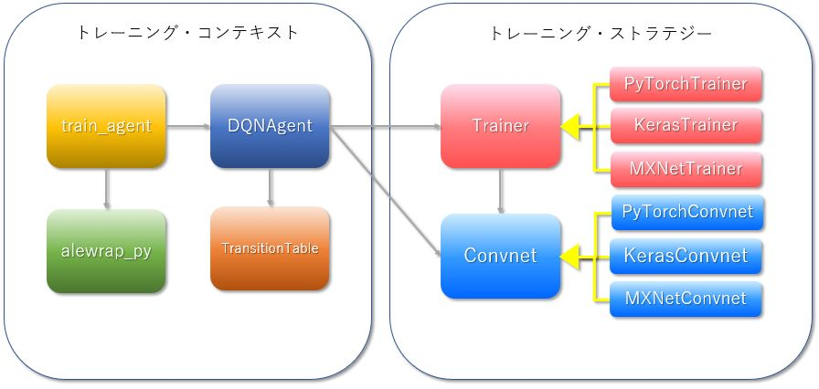

# PyTorch、MXNet、TensorflowおよびCNTKを使用した、PythonによるDQN3.0レベルのパフォーマンスを有するDQN実装

[<sup>For English.</sup>](README.md)

## 概要


このリポジトリにはPyTorch, MXNet, TensorflowそしてCNTK(後の2つはKeras上で)といったメジャーなDeep Learningフレームワーク(以下、DLフレームワーク)を使用したDeep Q-Network[(Mnih et al., 2015)](https://www.nature.com/articles/nature14236)(DQN)の実装が含まれています。<br>
各DLフレームワークは、DQNエージェントを有するトレーニング・コンテキストから呼び出されるトレーニング・ストラテジー ― ネットワーク部および最適化部 ― の実装に用いられ、同一条件下での各DLフレームワークの性能比較が可能となっています([Figure 1](#Figure1))。<br>
これらの実装方法とパフォーマンスは、[Mnih et al., [2015]](https://www.nature.com/articles/nature14236)の参照実装である[DQN3.0](https://github.com/deepmind/dqn)と全く同じです.

詳細は[こちら]( https://elliotttradelaboratory.github.io/DQN/)を参照してください。



<a name="Figure1">Figure 1:　システム概要図</a>

<br>

## インストール概要

* インストールにはLinuxが必須です。
* GPUの使用を強く推奨します。　なぜならば、以下のスペックのPC上での5000万ステップの学習に約3日間を要すからです。

<a name="Table1"/>Table 1:　動作確認PCスペック

<table>
  <tr>
    <td>CPU</td><td>Intel Core i7-7700K (Kaby Lake)</td>
  </tr>
  <tr>
    <td>Mem</td><td>64GB</td>
  </tr>
  <tr>
    <td>GPU</td><td>GTX1080ti×2</td>
  </tr>
  <tr>
    <td>OS</td><td>Ubuntu 16.04</td>
  </tr>
</table>

<br>

### ◇Deep Learningフレームワーク

この実装は複数のDLフレームワークを使用していますが、それらすべてをインストールすることも、または1つのDLフレームワークのみをインストールすることも可能です。　しかし、Tensorflowはロギングのために必須です。

最も簡単にあなたのLinux環境を壊すことなく実行させる方法は、「[1. Dockerで実行する場合](#1-dockerで実行する場合)」に従い、[Dockerfiles](./install)を使用し、[Docker](https://www.docker.com/)上に環境を構築することです。

特に、CNTKの場合、異なる引数を指定したトレイニングプロセスを並行に実行させたい時はDockerを使うと便利です。　なぜならば、CNTKの並行処理はMPIで実装されているため、プロセスを実行する際には`mpiexec`を使用して`mpiexec --npernode $num_workers python training.py`というように実行させなければならないからです[<sup>[1]</sip>](#cntk_mpi)。

もしDockerを使用せずLinuxに直接インストールしたい場合は、「[2. Docker以外の環境で実行する場合](#2-docker以外の環境で実行する場合)」に従ってインストールすることができます。

もし上記以外の方法でインストールしたい場合、[installディレクトリ](./install)にあるインストール・スクリプトファイルが、どのようにインストールしたらよいかを理解するための参考になります。　特に、DLフレームワークをインストールする際には、installディレクトリにある _\<framework name\>_ _install.shに従いインストールする必要があります。　なぜならば、このDQN実装がDLフレームワークの将来のバージョンの影響により動作しなくなることを防ぐために、各DLフレームワークのバージョンを厳密に指定しているからです。

### ◇Arcade Learning Environment

この実装では、[Deep Mindのalewrap](https://github.com/deepmind/alewrap)をPythonで再現した[alewrap_py](https://github.com/ElliottTradeLaboratory/alewrap_py)を使用していますが、[Open AIのGym](https://github.com/openai/gym)も使用することができます。　alewrap_pyはこのモジュールのサブモジュールなので自動的にインストールすることが可能ですが、Gymはそれとは別にインストールする必要があります（しかし、必須ではありません）。<br>
しかし、Gymをインストールすることのアドバンテージは、alewrap_py版との比較ができることだけでなく、Gymに同梱されているatari-pyが、全てのAtariゲームモジュールを同梱しているため、それらのモジュールをインターネット上で探す必要が無くなるということです。<br>
もし「[1. Dockerで実行する場合](#1-dockerで実行する場合)」または「[2. Docker以外の環境で実行する場合](#2-docker以外の環境で実行する場合)」に従ってインストールすると、Gymは自動的にインストールされます。

## Installation手順

### 1. Dockerで実行する場合

#### 1-1. Install nvidia-docker

次の手順に従い、nvidia-dockerをインストールします:
https://github.com/NVIDIA/nvidia-docker/wiki/Installation-(version-2.0)

#### 1-2. リポジトリのクローン

```
cd <clone root dir>
git clone https://github.com/ElliottTradeLaboratory/DQN.git
```

注：もしalewrap_pyやxitariのソースコードも見たい場合は、`--recursive`を指定することでそれらを同時にダウンロードすることもできます。


#### 1-3. Docler imageのビルド

各DLフレームワーク用のDocker imageを次の手順に従いビルドします:
```
$ cd <clone root dir>/DQN/install
$ ./build_docker_images <framework name> or all
　　・
　　・
　　・
REPOSITORY          TAG                 IMAGE ID            CREATED             SIZE
pythorch            latest              xxxxxxxxxxxx        xxxxxxx             xxxxxx
tensorflow          latest              xxxxxxxxxxxx        xxxxxxx             xxxxxx
cntk                latest              xxxxxxxxxxxx        xxxxxxx             xxxxxx
mxnet               latest              xxxxxxxxxxxx        xxxxxxx             xxxxxx
$
```

#### 1-4. DQNの実行

```
$ cd <clone root dir>/DQN
$ ./run_docker <framework name> [--logdir <log dir>]
mount /mnt/log_dir --> <log dir> if specified --logdir otherwise /tmp 
root@xxxxxx:/# cd DQM
root@xxxxxx:/DQN# ./run --backend <backend name> --env <game name> [options]
```

### 2. Docker以外の環境で実行する場合

#### 2-1. CUDAとcuDNNのインストール

GPUを使用する場合は、次のサイトに従いCUDAとcuDNNをインストールする必要があります:

CUDA  : ダウンロード: https://developer.nvidia.com/cuda-toolkit-archive<br>
　　　　インストールガイド: https://docs.nvidia.com/cuda/cuda-installation-guide-linux/index.html<br>
cuDNN : ダウンロー: https://developer.nvidia.com/rdp/cudnn-download<br>
　　　　インストールガイド: [cuDNN5.1](http://developer2.download.nvidia.com/compute/machine-learning/cudnn/secure/v5.1/prod/doc/cudnn_install.txt?4Y7u0FqHrotFcmVuCKOpM2anE-n8iMSBbn9WCrSMFTUFQzXCSGfEIkdPvFi0yoyTYBTKJzIiKiVwvgSYDqnfDzpew8WT1PdIAnXOeStXoMX2meBxzvBWZmNaVc3dt5u8Cv96mWCoTVp87ppWFM22UG1vqwAgwu4pR-W7m7fuHGOfIMYr), [cuDNN6.0](http://developer2.download.nvidia.com/compute/machine-learning/cudnn/secure/v6/prod/Doc/cudnn_install-2.txt?5e1fCcgO0eYlHY7zwZH-LBiJJBZRX4pF_wv1Gf3hq1lpsF6Q0pvkc0BkdZKVwfxaT-m8iAjLn0ZV6NRh_-jGp8GCMDnmUmCHtxQ82UQnwQVlrzZebTFGRm5q90Ic8S7UC2SMG0Z-NXlwLQfqOpr7l6YErWhJB1Ai2dc4ggsXjPFAtEx_)

注）CUDAとcuDNNのバージョンは使用するDLフレームワークのバージョンに依存します。 詳しくは[説明](#説明)をご覧ください。

#### 2-2. リポジトリのクローン

```
$ cd <clone root dir>
$ git clone --recursive https://github.com/ElliottTradeLaboratory/DQN.git
```

#### 2-3. インストールスクリプトの実行

```
$ cd <clone root dir>/DQN/install
$ ./install_your_linux.sh <framework name> or all
```
#### 2-4. Run DQN

```
$ cd <clone root dir>/DQN
$ ./run --backend <backend name> --env <game name> [options]
```


### 3. Visualization
```
$ cd <log dir>/<game name>
$ tensorboard --logdir .
```

### 説明
* _\<clone root dir\>_ は、githubよりリポジトリをクローンするための任意のディレクトリです。<br>
* _\<log dir\>_ はTensorbord用のログを出力するための任意のディレクトリです。　デフォルトは`/tmp`。<br>
* _\<framework name\>_ は以下になります。

_\<framework name\>_ | インストールされるDLフレームワーク[<sup>[2]</sup>](#fw)| CUDA | cuDNN
---------------|-----|-----|-----
`pytorch` | PyTorch 0.3.0.post4<br> Tensorflow 1.4.1(cpu) | 8.0 | 6.0 
`mxnet` | MXNet 1.0.0<br> Tensorflow 1.2.1(cpu) | 8.0 | 5.1
`tensorflow` | Tensorflow-gpu 1.4.1<br>Keras 2.1.2 | 8.0 | 6.0
`cntk` | CNTK 2.3.1<br> Tensorflow 1.4.1(cpu)<br>Keras 2.1.2 | 8.0 | 6.0

* _\<game name\>_ は、<br>
　alewrap_pyの場合,  `.bin`を除いたゲームモジュール名(e.g. `breakout`)。<br>
　Gymの場合, GymのEnv名(e.g. `Breakout-v0`)。<br>
* _\<backend name\>_ は、以下になります。

_\<backend name\>_ | ネットワークで使用するDLフレームワーク
---------------|----------
`pytorch` | PyTorch with torch.nn package
`pytorch_legacy` | PyTorch with torch.legacy.nn package
`mxnet` | MXNet
`tensorflow` | Tensorflow with Keras
`cntk` | CNTK with Keras


***
<a name="cntk_mpi"><sup>[1]</sup></a> https://docs.microsoft.com/en-us/cognitive-toolkit/Multiple-GPUs-and-machines<br>
<a name="fw"><sup>[2]</sup></a> インストールされる各フレームワークは、テストに使用したバージョンです。<br>
